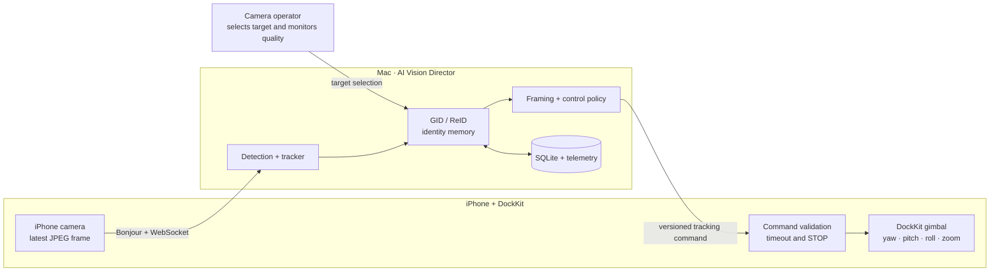

# AI Vision Director

**A local AI camera assistant for vehicle tracking, persistent identity,
real-time reframing, and Apple DockKit gimbal control.**

[繁體中文](README.md) · **English** ·
[Watch demo](https://youtu.be/vCB8icjmaDg) ·
[Architecture docs](docs/architecture/README.md) ·
[Release history](CHANGELOG.md)

[](https://github.com/LN-676/AI-Vision-Director/actions/workflows/ci.yml)

[](https://youtu.be/vCB8icjmaDg)

> [!IMPORTANT]
> **Source-visible employment portfolio — not open source.** Public access is
> provided for browser-based portfolio review. Cloning, downloading, running,
> copying, modifying, redistribution, and commercial or non-commercial use are
> not licensed. See [LICENSE](LICENSE).

## Core problem

Motorsport, sports, and event camera operators spend long periods repeating the
same demanding task: find the selected vehicle, keep it framed, recover after
temporary occlusion, and move the camera smoothly without creating unsafe
hardware behavior.

AI Vision Director keeps people responsible for setup, target selection,
visual judgment, monitoring, and live decisions. It automates the repetitive
closed loop between camera frames, vehicle identity, composition, and gimbal
movement.

| People remain responsible for | The system automates |
| --- | --- |
| Equipment placement and shooting intent | Vehicle detection and short-term tracking |
| Selecting the vehicle to follow | Persistent GID/ReID identity and reacquisition |
| Visual taste, timing, and exception handling | Reframing, zoom targets, and motion policy |
| Final quality and safety oversight | DockKit commands, limits, timeouts, and safe STOP |

## System demo

The [24-second demo](https://youtu.be/vCB8icjmaDg) shows the implemented system
running with a Mac, an iPhone, and a physical DockKit-compatible gimbal. It
shows the desktop tracking view, the selected vehicle, and the hardware
responding as the vehicle moves across the scene.

## Three engineering decisions that define the system

| Problem | Design decision | Why it matters |
| --- | --- | --- |
| A tracker ID is temporary and may change after occlusion, leaving the frame, or a camera cut. | Separate short-lived **LID** tracker identity from persistent **GID** vehicle identity; record typed reasons and scores for every identity decision. | The system follows the selected vehicle identity instead of trusting whichever bounding box currently has the same tracker number. [Decision details](docs/architecture/identity-decisions.md) |
| A wrong or low-quality embedding can poison future ReID decisions. | Admit gallery features only through identity, class, quality, duplicate, and provenance gates; retain audited rollback instead of silently deleting evidence. | Reacquisition quality does not gradually collapse because one bad crop became trusted identity memory. [Gallery safeguards](docs/architecture/gallery-contamination-prevention.md) |
| A delayed or invalid network command can move physical hardware incorrectly. | Use a fail-closed chain: endpoint verification, a four-second handshake deadline, sequence validation, bounded control policy, and a 500 ms tracking timeout that triggers STOP. | Network loss, stale messages, target loss, and invalid data become safe stopped states rather than uncontrolled motor motion. [WebSocket boundary](docs/architecture/websocket-components.md) · [Control policy](docs/architecture/camera-control-policy.md) |

## System at a glance



The iPhone and Mac communicate over a reachable local network. Bonjour
discovers the desktop service and WebSocket carries camera frames and tracking
commands. NFC is used only for initial Flow 2 Pro pairing; continuous motor
control goes through Apple DockKit.

## Implemented capabilities

- Video file, URL, screen-region, webcam, and iPhone inputs.
- YOLO detector backends with ByteTrack or BoT-SORT tracker adapters.
- Persistent GID identity, feature galleries, Find GID, coasting, search, and
  automatic reacquisition.
- Fixed Cut, AI Tracking, and In/Out Auto framing modes.
- DockKit yaw, pitch, roll, Home, emergency STOP, and physical iPhone zoom.
- Latest-frame backpressure, sequence validation, rate and acceleration limits,
  and timeout safety.
- PySide6 dual-monitor workspace plus a retained Tkinter compatibility layer.
- Local SQLite identity storage, structured telemetry, diagnostics, and
  offline evaluation.
- Read-only tablet Mission Control and opt-in cloud control-plane components.

## Benchmark evaluation

The Benchmark Center supports two distinct profiles:

- **Quick Auto** runs repeatable, annotation-free proxy comparisons for model
  consistency, coverage, FPS, and latency. Its values are not mAP, HOTA, IDF1,
  or ground-truth identity accuracy.
- **Verified** uses a matching Golden video and ground-truth JSONL for standard
  Detection, Tracking, Identity, Framing, Control, and Realtime evaluation,
  with COCO and MOTChallenge exports.

Benchmark profiles and dataset versions must match before results are compared.
The design and metric boundaries are documented in
[Benchmark Center](docs/architecture/benchmark-center.md) and
[Offline Replay](docs/architecture/offline-replay.md).

## Components

| Component | Responsibility |
| --- | --- |
| Desktop | Detection, tracking, GID/ReID, framing, control policy, persistence, diagnostics, and evaluation |
| iOS camera app | Camera capture, Bonjour discovery, WebSocket client, command validation, DockKit execution, and last-line safety |
| Dashboard | Read-only monitoring and high-level remote control on a private network |
| Evaluation | UI-free replay, benchmark profiles, telemetry, COCO export, and MOTChallenge export |

## Repository map

```text
AI-Vision-Director/
├── src/autocamtracker/       # Desktop application and shared use cases
├── tests/                    # Python unit and integration tests
├── ios/DockKitTester/        # iOS app, Swift package, and Swift tests
├── dashboard/                # Web dashboard and tablet remote console
├── docs/architecture/        # Design boundaries and rationale
├── models/                   # Detection and ReID model assets
├── api/schema/               # Versioned OpenAPI schema
├── migrations/               # Database migrations
├── infra/                    # Opt-in cloud infrastructure
├── docker/                   # API and benchmark containers
└── tools/                    # Internal launch and maintenance utilities
```

## Portfolio evaluation boundary

This repository is a source-visible employment portfolio, not an open-source
package or public trial. Reviewers may read the source and documentation on
GitHub, watch the public demo, discuss the engineering decisions, and share the
original repository link.

No permission is granted to clone, download, install, execute, copy, modify,
reproduce, redistribute, host, deploy, or use the project for commercial or
non-commercial purposes. Commands and configuration retained in technical
documents describe the author's engineering workflow; they do not grant
permission to use the software. Written permission is required for local
technical evaluation or collaboration. See [LICENSE](LICENSE) and
[CONTRIBUTING.md](CONTRIBUTING.md).

## Documentation

- [Architecture index](docs/architecture/README.md)
- [iOS architecture and device notes](ios/DockKitTester/README.md)
- [Identity decisions](docs/architecture/identity-decisions.md)
- [Gallery contamination prevention](docs/architecture/gallery-contamination-prevention.md)
- [Camera control policy](docs/architecture/camera-control-policy.md)
- [WebSocket components](docs/architecture/websocket-components.md)
- [Benchmark Center](docs/architecture/benchmark-center.md)
- [Versioning policy](docs/versioning.md)
- [Release history](CHANGELOG.md)

## Safety and local data

- Handshake completion is required before camera, motor-status, or control data
  is exchanged.
- Disconnects, invalid data, stale sequences, target loss, and tracking timeout
  trigger STOP.
- DockKit System Tracking is disabled while custom AI control is active so two
  controllers cannot command the motors simultaneously.
- Runtime identity databases, telemetry, caches, logs, and test media are not
  release artifacts.
- Model assets may use Git LFS; internal release validation must confirm that
  required LFS objects are present.

## License

Copyright © 2026 LN-676. All rights reserved. This is a source-visible
portfolio, not an open-source project. See [LICENSE](LICENSE).
