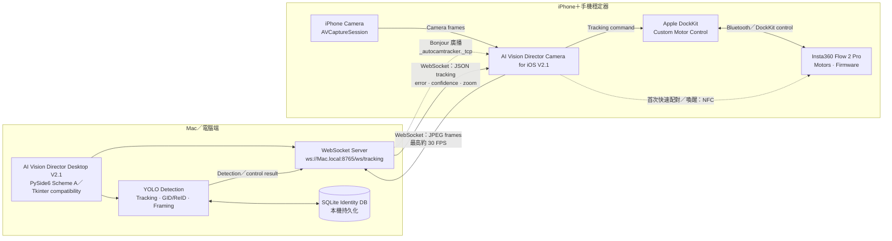
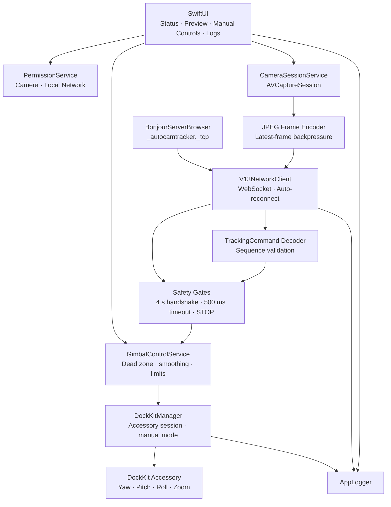
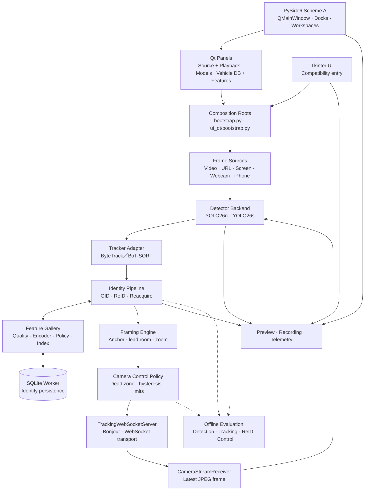

# AI Vision Director V2.1

[中文](#中文) · [English](#english)

---

## 中文

AI Vision Director 是一套由 **Mac 桌面端**與 **iPhone 相機／DockKit 端**共同組成的 AI 車輛攝影系統。桌面端執行物件偵測、單車追蹤、GID 長期身份辨識、數位構圖與控制決策；iPhone 端提供相機畫面，並把桌面端的追蹤結果轉成 Apple DockKit 雲台動作。

這兩端是同一個產品的兩個協同元件，因此放在同一個 repository 中：

| 元件 | 正式名稱 | 主要責任 |
| --- | --- | --- |
| Desktop | AI Vision Director Desktop V2.1 | PySide6／Tkinter 介面、AI 偵測、追蹤、ReID、構圖、WebSocket Server、資料庫與評估 |
| iOS | AI Vision Director Camera for iOS V2.1 | 相機擷取、JPEG 串流、Bonjour 探索、WebSocket Client、DockKit 控制與安全停止 |

目前正式產品版本是 **V2.1**。PySide6 方案 A 是主要模組化工作區；既有 Tkinter 入口仍保留。產品版本升級不改變 1.0 WebSocket contract、SQLite 格式、cache 路徑、Bonjour service type 或 DockKit safety policy。舊的 V1.77 程式碼保留在 Git tag `v1.77`。

## 整體硬體與資料連接



### 連線方式的重要說明

- **NFC 只負責快速配對入口**：iPhone 輕觸 Flow 2 Pro 的 NFC 區域後開始 DockKit 配對；首次配對完成後，穩定器開機並開啟 iPhone Bluetooth 即可自動重連。持續的控制資料不是透過 NFC 傳送。請參考 [Insta360 官方 NFC 配對說明](https://onlinemanual.insta360.com/flow2pro/en-us/camera/firstuse/nfconetouchpairing)。
- **iPhone 與穩定器**：iOS App 透過 Apple DockKit API 控制相容穩定器。App 會關閉 DockKit System Tracking，改用桌面 AI 的自訂目標控制。請參考 [Apple DockKit 文件](https://developer.apple.com/documentation/dockkit)。
- **Mac 與 iPhone**：兩端在可互通的區域網路上使用 WebSocket。桌面端透過 Bonjour 廣播 `_autocamtracker._tcp`，iOS 優先使用 `.local` 位址、自動偵測 IP 變更並修正保存的舊 URL。
- **安全握手**：每個候選端點有 4 秒握手期限。握手完成前不傳 camera frame、馬達狀態或控制訊息；斷線、無效訊息或 tracking timeout 會 STOP。
- **硬體儲存邊界**：AI 模型、GID gallery 與身份資料不會寫入穩定器。相機 frame 主要以即時串流在記憶體中流動；需要持久化的 GID feature 與 metadata 才會寫入 Mac 的 SQLite。

## iOS 軟體架構



### iOS 各區責任

- `CameraSessionService`：管理 iPhone 相機、preview、倍率與 JPEG frame。
- `V13NetworkClient`：Bonjour 探索、端點驗證、WebSocket 收發、IP 自動修正、握手 timeout 與重連。
- `TrackingCommand`：解碼版本化 JSON，驗證 sequence 與欄位。
- `GimbalControlService`：將畫面誤差轉成安全的 yaw／pitch 速度與 zoom。
- `DockKitManager`：取得 DockKit accessory、切換 manual mode、執行姿態與 Home 控制。
- Safety gates：握手前禁止送 frame；斷線、逾時、target lost 或無效命令時立即停止。

iOS 安裝、簽名與實機操作請參考 [iOS README](ios/DockKitTester/README.md)。

## Desktop 軟體架構



### Desktop 各區責任

- `vision/`：來源讀取、YOLO inference、tracker adapter、相機校正、GMC 與構圖。
- `tracking/`：detections、GID/LID、ReID、feature gallery、污染防護與 SQLite persistence。
- `server/`：WebSocket wire protocol、Bonjour、iPhone frame receiver、control publisher 與安全 policy。
- `ui_qt/`：PySide6 QMainWindow、Before／After 雙監看、模組化 Dock、Workspace、整合 Playback 的來源分頁、模型選擇、Vehicle Database 與 Feature Manager。
- `ui/`：保留的 Tkinter 相容介面，共用相同 application use case。
- `evaluation/`：無 UI 的離線 replay、Detection／Tracking／ReID／System／Control 指標。
- `domain/` 與 `core/`：跨模組資料契約、timestamp、frame pipeline 與 application boundary。

## 主要功能

- 支援 `webcam`、`video_file`、`video_url`、`screen_region` 與 `iphone`。
- High FPS profile：YOLO26n＋ByteTrack，針對約 30 FPS iPhone 串流。
- Balanced ID profile：YOLO26s＋BoT-SORT／ReID。
- GID 長期身份與 LID 短期 tracker identity 分離。
- 手動建立 GID、bbox 綁定、Find GID、自動 reacquire 與 feature gallery。
- Master feature 寫入前的 class、ReID、品質與重複檢查，降低 gallery 污染。
- Fixed Cut、AI Tracking、In/Out Auto 等構圖模式。
- DockKit 實體 yaw／pitch／roll、Home 與 iPhone camera zoom 控制。
- 失追 coasting、zoom hold／ramp、速度與加速度限制、timeout STOP。
- 可版本化的相機 calibration、GMC、timestamp pipeline 與離線 benchmark。
- 即時效能評估會分開統計來源序號缺口、iPhone send drop、Desktop latest-frame overwrite、decode failure 與影片主動跳幀，並顯示 latency percentile 與失追 frame 區間。
- 一鍵診斷會彙整 source、decoder、detector、tracker、ReID、GMC、framing、SQLite、WebSocket、DockKit 與 motor control 的健康狀態及結構化事件。

## V2.1 更新內容

- Playback 已整合到 Source 的 Video file 頁並移除獨立 Dock；新增保持按下狀態的 Loop，影片結束時從第 0 frame 重新播放。
- 已選定並綁定 GID 的紅色 bbox 只顯示 GID 與編號；未選取物件仍可顯示 LID 追蹤資訊。
- Tracking 頁新增 Detection model 與 ReID model 下拉選單，可掃描 `code/model` 內的 `.pt` 與 `*-reid.onnx` 模型並套用到既有 runtime use case。
- Find GID 信心門檻、Add Manual Feature、Start/Stop Auto Feature 已整合到 Vehicle Database；獨立 ReID/Features Dock 已移除。
- Manual Feature 通過身份、品質、模型與重複 gate 後直接 commit 至 SQLite `vehicle_features`；Auto Feature 啟動後會持續對新 frame 取樣，只有通過相同安全 gate 的 feature 才會寫入。
- Desktop 與 iOS 顯示版本更新至 V2.1，iOS build 2101；1.0 WebSocket contract、Bonjour `_autocamtracker._tcp` 與 DockKit safety policy 保持不變。

## V2.0 更新內容

- 新增 PySide6 方案 A「雙監看平衡型」工作區，使用 QMainWindow、可移動／浮動 Dock、Window menu、QSettings 與 Tracking／Identity／Performance workspace。
- Before／After 以橫式影像最大可用空間排列，支援監看區最大化；保留黑邊顯示 live/source FPS、frame/drop、E2E、inference、pipeline、receive、decode 與同步延遲。
- 影片依 source FPS 與媒體時鐘正常播放；推論落後時跳過逾時影格，避免慢動作。Timeline 顯示 frame-accurate timecode。
- LID／GID 標籤提高到 80 px 並加描邊，提升監看辨識度。
- Source 改為來源專屬分頁，只顯示目前來源需要的欄位；iPhone 頁可顯示及複製 WebSocket URL，Qt 啟動 iPhone 來源時會自動啟動 listener。
- Vehicle Database 全欄唯讀，支援首張 feature 照片懸浮預覽；雙擊車輛開啟自適應圖庫，可用 Command／Ctrl／Shift 多選並將污染 feature 從有效 ReID matching 移除，同時保留 audit record。
- iOS App 更新至 V2.0 build 2001，新增貼上 Desktop URL，並保留 Bonjour 自動探索、IP 修復、握手期限、自動重連及原有 DockKit safety gates。
- Python 正式類別名稱修正為 `AIVisionDirectorApp`，並保留 `AIVisonDirectorApp` 與 `AutoCamTrackerApp` 相容 alias。
- 保留既有 Tkinter UI、`autocamtracker` package、`ai-vision-director` CLI、1.0 WebSocket contract、SQLite 與 Bonjour `_autocamtracker._tcp`。

## Repository 結構

```text
AI-Vision-Director/
├── src/autocamtracker/       # Desktop V2.1 Python application and shared use cases
│   ├── ui_qt/                # PySide6 Scheme A workspace
│   └── ui/                   # Preserved Tkinter compatibility UI
├── tests/                    # Desktop unit and integration tests
├── ios/DockKitTester/        # iOS V2.1 Xcode project and Swift tests
├── docs/architecture/        # Architecture contracts and design notes
├── evaluation/               # Versioned evaluation scenarios
├── code/model/               # YOLO, tracker and ReID model assets
├── tools/                    # Launch and maintenance utilities
└── outputs/                  # Local runtime data; excluded from releases
```

`DockKitTester` 是目前保留的 Xcode 內部 target／資料夾名稱；App 顯示名稱與產品文件均為 **AI Vision Director Camera for iOS V2.1**。

## Desktop 安裝與執行

建議使用 Python 3.13 或目前相容版本。

```bash
git clone https://github.com/LN-676/AI-Vision-Director.git
cd AI-Vision-Director
python -m venv .venv
.venv/bin/python -m pip install -r requirements.txt
.venv/bin/python -m pip install -e .
.venv/bin/ai-vision-director-qt
```

保留的 Tkinter 相容入口：

```bash
.venv/bin/ai-vision-director
```

`ai-vision-director` 仍啟動既有 Tkinter UI；兩個入口共用同一套 application use case、資料格式與 WebSocket contract。

也可以直接使用 module entry point：

```bash
PYTHONPATH=src .venv/bin/python -m autocamtracker.main
```

Mac 與 iPhone 必須位於可互相存取的同一區域網路。單純 USB 充電線或 Xcode deploy 不會自動成為 App 資料通道；USB 模式需要 Personal Hotspot USB、USB Ethernet 或其他可互通 IP 介面。

## 資料與安全注意事項

- `outputs/vehicle_identity.sqlite3` 是本機身份資料，不應放入 release。
- `outputs/`、`.venv/`、cache、log、測試影片與暫存輸出不屬於乾淨版本內容。
- 握手前不傳 frame；WebSocket 失聯、tracking timeout 或資料驗證失敗時會執行 STOP。
- DockKit System Tracking 會在自訂 AI 控制啟用時關閉，避免兩套追蹤同時控制馬達。
- 模型權重可能由 Git LFS 管理；clone 後若缺少模型，請確認 Git LFS objects 已完整下載。

## 版本與歷史

- 最新程式碼：`main`
- 目前發布：`AI-Vision-Director-V2.1`
- 舊版封存：`v1.77` 與其他歷史 tags
- Desktop 與 iOS 使用同一個 V2.1 產品版本，並維持 1.0 WebSocket contract 相容。
- 版本變更內容：[CHANGELOG.md](CHANGELOG.md)

---

## English

AI Vision Director is an AI vehicle-filming system composed of a **Mac desktop component** and an **iPhone camera/DockKit component**. The desktop performs object detection, single-vehicle tracking, persistent GID identity matching, digital reframing, and control decisions. The iPhone provides camera frames and translates desktop tracking results into Apple DockKit gimbal movement.

Both components are maintained in this monorepo because they share one versioned WebSocket contract:

| Component | Product name | Responsibility |
| --- | --- | --- |
| Desktop | AI Vision Director Desktop V2.1 | PySide6/Tkinter delivery layers, detection, tracking, ReID, framing, WebSocket server, persistence, and evaluation |
| iOS | AI Vision Director Camera for iOS V2.1 | Camera capture, JPEG streaming, Bonjour discovery, WebSocket client, DockKit control, and safety stop |

The current product release is **V2.1**. PySide6 Scheme A is the primary modular workspace and the Tkinter entry point remains available. The product release does not change the 1.0 WebSocket contract, SQLite format, cache paths, Bonjour service type, or DockKit safety policy. The previous V1.77 source remains available through the `v1.77` Git tag.

## End-to-end hardware and data flow

The first Mermaid diagram above is the canonical hardware map:

- NFC starts the initial one-tap Flow 2 Pro pairing flow; it is not the continuous motor-control transport.
- After pairing, the iPhone reconnects to the gimbal with Bluetooth enabled and controls it through Apple DockKit.
- The Mac and iPhone exchange data over WebSocket. Bonjour advertises `_autocamtracker._tcp` and lets iOS prefer a stable `.local` endpoint.
- iOS sends JPEG camera frames to the Mac. The Mac returns JSON tracking commands containing target error, confidence, predicted state, and zoom.
- Frames normally remain transient in memory. Persistent GID metadata and selected feature embeddings are stored in the Mac-side SQLite database; AI models and identity data are never written to the gimbal.

See the [official Insta360 NFC pairing guide](https://onlinemanual.insta360.com/flow2pro/en-us/camera/firstuse/nfconetouchpairing) and [Apple DockKit documentation](https://developer.apple.com/documentation/dockkit) for the accessory boundary.

## iOS architecture

The iOS diagram above maps these responsibilities:

- `CameraSessionService`: AVCaptureSession, preview, physical zoom, and JPEG frames.
- `V13NetworkClient`: Bonjour discovery, endpoint verification, WebSocket I/O, saved-IP repair, handshake timeout, and reconnect.
- `TrackingCommand`: versioned JSON decoding and sequence validation.
- `GimbalControlService`: safe yaw/pitch velocity and zoom derived from screen-space error.
- `DockKitManager`: DockKit accessory lifecycle, manual mode, pose, and Home commands.
- Safety gates: no frames before the handshake; STOP on disconnect, timeout, target loss, or invalid commands.

For signing and physical-device setup, see the [iOS README](ios/DockKitTester/README.md).

## Desktop architecture

The desktop diagram above maps these responsibilities:

- `vision/`: source adapters, YOLO inference, tracker adapters, calibration, GMC, and framing.
- `tracking/`: detections, GID/LID state, ReID, feature gallery, contamination prevention, and SQLite persistence.
- `server/`: wire protocol, Bonjour, WebSocket transport, iPhone frame receiver, control publisher, and safety policy.
- `ui_qt/`: PySide6 QMainWindow, Before/After monitors, modular docks, workspaces, source pages with playback, model selection, Vehicle Database, and Feature Manager.
- `ui/`: preserved Tkinter compatibility layer sharing the same application use cases.
- `evaluation/`: UI-free replay and Detection, Tracking, ReID, System, and Control metrics.
- `domain/` and `core/`: shared contracts, timestamps, frame pipeline, and application boundaries.

## Key features

- Video file, URL, screen region, webcam, and iPhone inputs.
- YOLO26n + ByteTrack High FPS profile and YOLO26s + BoT-SORT/ReID Balanced ID profile.
- Separate long-lived GID identity and short-lived tracker LID.
- Manual GID creation, bbox linking, Find GID, automatic reacquisition, and feature galleries.
- Class, ReID, quality, and duplicate gates before Master feature writes.
- Fixed Cut, AI Tracking, and In/Out Auto framing modes.
- DockKit yaw/pitch/roll, Home, and physical iPhone camera zoom control.
- Lost-target coasting, zoom hold/ramp, rate limits, acceleration limits, and timeout STOP.
- Versioned calibration, GMC, timestamp pipeline, offline replay, and benchmark infrastructure.

## V2.1 release highlights

- Integrated Playback into Source > Video file and removed its standalone dock. The persistent Loop toggle seeks to frame zero at end of file.
- Red selected bounding boxes linked to a GID now display only the GID and number; unselected detections retain LID tracking context.
- Added Detection model and ReID model selectors to Tracking, scanning `.pt` and `*-reid.onnx` assets under `code/model` and applying them through existing runtime use cases.
- Integrated the Find GID confidence threshold, Add Manual Feature, and Start/Stop Auto Feature into Vehicle Database and removed the standalone ReID/Features dock.
- Manual Feature commits accepted identity/quality/model/duplicate-gated records to SQLite `vehicle_features`. Auto Feature now keeps sampling subsequent frames and writes only features that pass the same safety gates.
- Updated Desktop and iOS display versions to V2.1 and iOS build 2101 while preserving the 1.0 WebSocket contract, `_autocamtracker._tcp`, and DockKit safety policy.

## V2.0 release highlights

- Added the PySide6 Scheme A balanced dual-monitor workspace with QMainWindow, movable and floating docks, Window menu actions, QSettings, and Tracking, Identity, and Performance workspaces.
- Maximized horizontal Before/After monitor space while reserving letterbox readouts for live/source FPS, frame/drop counts, and end-to-end, inference, pipeline, receive, decode, and synchronization latency.
- Synchronized file playback to source FPS and media time, skipping overdue frames instead of producing slow motion, and added frame-accurate timeline timecode.
- Increased LID/GID overlays to 80 px with outlines for clear monitoring.
- Split Source into source-specific pages. The iPhone page displays and copies the WebSocket URL, and the Qt process automatically starts its listener for iPhone sessions.
- Made Vehicle Database read-only with first-feature hover previews. Double-click opens a responsive gallery where Command/Ctrl/Shift selects multiple contaminated features for removal from active ReID matching while retaining the audit record.
- Updated the iOS app to V2.0 build 2001 with desktop-URL paste support while preserving Bonjour discovery, stale-IP repair, handshake deadlines, automatic reconnect, and existing DockKit safety gates.
- Corrected the Python class to `AIVisionDirectorApp` while retaining `AIVisonDirectorApp` and `AutoCamTrackerApp` compatibility aliases.
- Preserved the Tkinter UI, `autocamtracker` package, `ai-vision-director` CLI, 1.0 WebSocket contract, SQLite format, and `_autocamtracker._tcp` Bonjour type.

## Install and run the desktop app

```bash
git clone https://github.com/LN-676/AI-Vision-Director.git
cd AI-Vision-Director
python -m venv .venv
.venv/bin/python -m pip install -r requirements.txt
.venv/bin/python -m pip install -e .
.venv/bin/ai-vision-director-qt
```

Preserved Tkinter compatibility entry point:

```bash
.venv/bin/ai-vision-director
```

`ai-vision-director` continues to launch Tkinter. Both delivery layers share the same application use cases, data formats, and WebSocket contract.

Module entry point:

```bash
PYTHONPATH=src .venv/bin/python -m autocamtracker.main
```

The Mac and iPhone must have mutually reachable IP connectivity. A charging cable or Xcode deployment alone does not create the app data channel.

## Safety and local data

- `outputs/vehicle_identity.sqlite3` contains local identity data and must not be shipped in a release.
- Runtime outputs, virtual environments, caches, logs, and test media are excluded from clean releases.
- No camera frame is sent before handshake completion.
- Disconnects, invalid data, or tracking timeout trigger STOP.
- DockKit System Tracking is disabled while custom AI motor control is active.

## Version history

- Latest code: `main`
- Current release: `AI-Vision-Director-V2.1`
- Archived releases: `v1.77` and earlier tags
- Desktop and iOS share the V2.1 product version while retaining the compatible 1.0 WebSocket contract.
- Release notes: [CHANGELOG.md](CHANGELOG.md)
