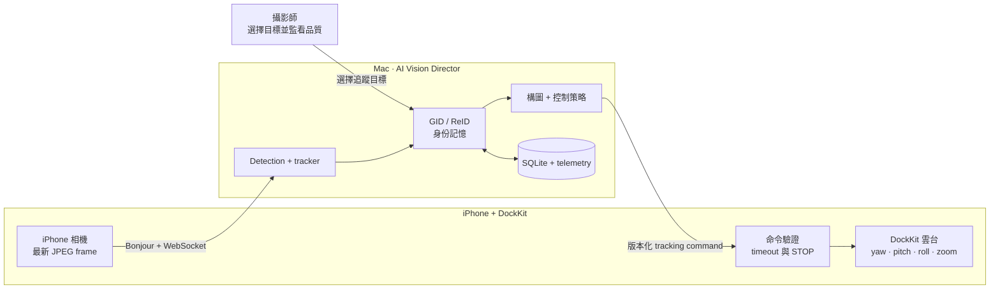

# AI Vision Director

**一套用於車輛追蹤、長期身份辨識、即時構圖與 Apple DockKit 雲台控制的本機
AI 攝影助理。**

**繁體中文** · [English](README.en.md) ·
[觀看 Demo](https://youtu.be/vCB8icjmaDg) ·
[架構文件](docs/architecture/README.md) ·
[版本變更紀錄](CHANGELOG.md)

[](https://youtu.be/vCB8icjmaDg)

> [!IMPORTANT]
> **Source-visible 求職作品集，不是開源專案。** 本 repository 僅供透過 GitHub
> 網頁閱讀與作品評估。作者不授權 clone、下載、執行、複製、修改、散布或商業／
> 非商業使用。完整條款見 [LICENSE](LICENSE)。

## 要解決的問題

賽車、運動與活動攝影師經常長時間重複同一件高負荷工作：找到指定車輛、保持構圖、
遮擋後重新找回，並平順移動相機，同時避免硬體在斷線或錯誤資料下持續運轉。

AI Vision Director 不取代攝影師。人仍負責架設、選擇目標、美感、監看與臨場判斷；
系統負責把相機畫面、車輛身份、數位構圖與雲台動作串成可停止、可追蹤的自動閉環。

| 人負責 | 系統自動化 |
| --- | --- |
| 設備位置與拍攝意圖 | 車輛偵測與短期追蹤 |
| 選擇要跟拍的車輛 | GID/ReID 長期身份與失追找回 |
| 美感、節奏與突發狀況 | 數位構圖、zoom 目標與控制策略 |
| 最終品質與安全監督 | DockKit 命令、限制、timeout 與安全 STOP |

## 真實系統 Demo

[24 秒實機 Demo](https://youtu.be/vCB8icjmaDg) 使用一台 Mac、一支 iPhone 與
一個實體 DockKit 相容雲台，畫面同時呈現 Desktop 追蹤介面、選定車輛，以及車輛
移動時的硬體反應。

這是實機系統展示，不是準確率 benchmark。目前驗證完成的範圍是一台 Mac＋一支
iPhone＋一個雲台；多機位中控仍屬 Roadmap，不列為現行能力。

## 定義這套系統的三個工程決策

| 問題 | 設計決策 | 為什麼重要 |
| --- | --- | --- |
| Tracker ID 在遮擋、離框或切鏡後可能改變。 | 把短期 tracker **LID** 與長期車輛 **GID** 分離，並記錄每次身份決策的 reason、score 與 sub-scores。 | 系統追的是使用者選定的車輛身份，不是剛好拿到相同 tracker 編號的 bbox。[決策細節](docs/architecture/identity-decisions.md) |
| 錯誤或低品質 embedding 會污染後續 ReID。 | Gallery 寫入必須通過身份、類別、品質、重複與 provenance gate；撤銷採有稽核紀錄的 rollback。 | 不會因為一張錯誤 crop 被當成可信身份記憶，讓找回能力逐步惡化。[污染防護](docs/architecture/gallery-contamination-prevention.md) |
| 延遲或無效網路命令可能造成實體馬達誤動。 | 採 fail-closed 控制鏈：端點驗證、4 秒握手期限、sequence validation、有界控制 policy，以及 500 ms timeout STOP。 | 斷線、舊訊息、失追與錯誤資料會進入安全停止，而不是讓馬達失控。[WebSocket 邊界](docs/architecture/websocket-components.md) · [控制策略](docs/architecture/camera-control-policy.md) |

## 系統一覽


```mermaid
flowchart LR
    HUMAN["攝影師<br/>選擇目標並監看品質"]

    subgraph IOS["iPhone + DockKit"]
        CAMERA["iPhone 相機<br/>最新 JPEG frame"]
        SAFETY["命令驗證<br/>timeout 與 STOP"]
        GIMBAL["DockKit 雲台<br/>yaw · pitch · roll · zoom"]
    end

    subgraph MAC["Mac · AI Vision Director"]
        DETECT["Detection + tracker"]
        IDENTITY["GID / ReID<br/>身份記憶"]
        FRAME["構圖 + 控制策略"]
        DATA[("SQLite + telemetry")]
    end

    HUMAN -->|"選擇追蹤目標"| IDENTITY
    CAMERA -->|"Bonjour + WebSocket"| DETECT
    DETECT --> IDENTITY --> FRAME
    IDENTITY <--> DATA
    FRAME -->|"版本化 tracking command"| SAFETY --> GIMBAL
```

iPhone 與 Mac 必須位於可互通的區域網路。Bonjour 用來找到 Desktop，WebSocket
傳送相機 frame 與追蹤命令。NFC 只負責 Flow 2 Pro 首次配對；持續馬達控制走
Apple DockKit。

## 已實作能力

- 支援影片、URL、螢幕區域、webcam 與 iPhone 輸入。
- YOLO detector 與 ByteTrack／BoT-SORT tracker adapter。
- GID 長期身份、Feature Gallery、Find GID、coasting、search 與自動 reacquire。
- Fixed Cut、AI Tracking 與 In/Out Auto 構圖模式。
- DockKit yaw、pitch、roll、Home、Emergency STOP 與 iPhone 實體 zoom。
- Latest-frame backpressure、sequence validation、速度／加速度限制與 timeout safety。
- PySide6 雙監看模組化工作區，並保留 Tkinter 相容介面。
- 本機 SQLite、結構化 telemetry、診斷與離線評估。
- 區網平板 Mission Control 與 opt-in 雲端控制面元件。

## 不誇大的評估方式

Benchmark Center 明確分成兩種 profile：

- **Quick Auto**：不需人工標註，用於可重複的模型一致性、coverage、FPS 與 latency
  proxy 比較；不是 mAP、HOTA、IDF1 或 ground-truth identity accuracy。
- **Verified**：搭配 Golden video 與 ground-truth JSONL，評估 Detection、Tracking、
  Identity、Framing、Control 與 Realtime，並支援 COCO／MOTChallenge 匯出。

只有 profile 與 dataset version 相同時才能直接比較。詳細設計見
[Benchmark Center](docs/architecture/benchmark-center.md) 與
[Offline Replay](docs/architecture/offline-replay.md)。

## 系統元件

| 元件 | 主要責任 |
| --- | --- |
| Desktop | Detection、tracking、GID/ReID、構圖、控制策略、持久化、診斷與評估 |
| iOS Camera App | 相機擷取、Bonjour、WebSocket、命令驗證、DockKit 執行與最後一道安全閘 |
| Dashboard | 區網內的唯讀監看與高階 Remote Control |
| Evaluation | 無 UI replay、benchmark profiles、telemetry、COCO 與 MOTChallenge 匯出 |

## Repository 結構

```text
AI-Vision-Director/
├── src/autocamtracker/       # Desktop 應用程式與共用 use cases
├── tests/                    # Python unit／integration tests
├── ios/DockKitTester/        # iOS App、Swift Package 與 Swift tests
├── dashboard/                # Web Dashboard 與平板 Remote Console
├── docs/architecture/        # 架構邊界與設計理由
├── models/                   # Detection／ReID 模型資產
├── api/schema/               # 版本化 OpenAPI schema
├── migrations/               # Database migrations
├── infra/                    # Opt-in 雲端基礎設施
├── docker/                   # API 與 benchmark containers
└── tools/                    # 內部啟動與維護工具
```

## 作品評估與授權邊界

本 repository 是 source-visible 求職作品集，不是開源套件或公開試用版。訪客可以在
GitHub 網頁閱讀程式碼與文件、觀看 Demo、討論工程決策，並分享原始 repository 連結。

作者不授權 clone、下載、安裝、執行、複製、修改、重製、散布、部署或商業／非商業
使用。技術文件保留的 command 與設定只記錄作者的工程流程，不構成使用授權。本機
技術評估或合作必須事先取得書面許可。完整條款見 [LICENSE](LICENSE)，外部貢獻政策
見 [CONTRIBUTING.md](CONTRIBUTING.md)。

## 文件索引

- [英文 README](README.en.md)
- [架構文件索引](docs/architecture/README.md)
- [iOS 架構與實機說明](ios/DockKitTester/README.md)
- [身份決策](docs/architecture/identity-decisions.md)
- [Feature Gallery 污染防護](docs/architecture/gallery-contamination-prevention.md)
- [相機控制策略](docs/architecture/camera-control-policy.md)
- [WebSocket 元件](docs/architecture/websocket-components.md)
- [Benchmark Center](docs/architecture/benchmark-center.md)
- [版本規則](docs/versioning.md)
- [版本變更紀錄](CHANGELOG.md)

## 安全與本機資料

- 握手完成前不交換 camera、motor status 或 control data。
- 斷線、無效資料、過期 sequence、失追與 tracking timeout 都會觸發 STOP。
- 自訂 AI 控制啟用時會關閉 DockKit System Tracking，避免兩套控制器同時命令馬達。
- Runtime identity database、telemetry、cache、log 與測試媒體不屬於 release artifact。
- 模型資產可能使用 Git LFS；內部 release 驗證必須確認所需 LFS objects 完整。

## License

Copyright © 2026 LN-676. All rights reserved. 本專案是 source-visible 作品集，
不是開源軟體。完整條款見 [LICENSE](LICENSE)。
