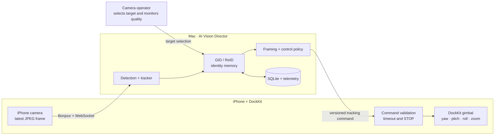

# AI Vision Director

**A local AI camera assistant for vehicle tracking, persistent identity,
real-time reframing, and Apple DockKit gimbal control.**

[English](#english) · [繁體中文](#繁體中文) ·
[Watch demo](https://youtu.be/vCB8icjmaDg) ·
[Architecture docs](docs/architecture/README.md) ·
[Release history](CHANGELOG.md)

[](https://youtu.be/vCB8icjmaDg)

> [!IMPORTANT]
> **Source-visible employment portfolio — not open source.** Public access is
> provided for browser-based portfolio review. Cloning, downloading, running,
> copying, modifying, redistribution, and commercial or non-commercial use are
> not licensed. See [LICENSE](LICENSE).

## English

## The problem

Motorsport, sports, and event camera operators spend long periods repeating the
same demanding task: find the selected vehicle, keep it framed, recover after
temporary occlusion, and move the camera smoothly without creating unsafe
hardware behavior.

AI Vision Director keeps people responsible for setup, target selection,
visual judgment, monitoring, and live decisions. It automates the repetitive
closed loop between camera frames, vehicle identity, composition, and gimbal
movement.

| People remain responsible for | The system automates |
| --- | --- |
| Equipment placement and shooting intent | Vehicle detection and short-term tracking |
| Selecting the vehicle to follow | Persistent GID/ReID identity and reacquisition |
| Visual taste, timing, and exception handling | Reframing, zoom targets, and motion policy |
| Final quality and safety oversight | DockKit commands, limits, timeouts, and safe STOP |

## Real-system demo

The [24-second demo](https://youtu.be/vCB8icjmaDg) shows the implemented system
running with a Mac, an iPhone, and a physical DockKit-compatible gimbal. It
shows the desktop tracking view, the selected vehicle, and the hardware
responding as the vehicle moves across the scene.

This is a physical-system demonstration, not an accuracy benchmark. Current
verified scope is one Mac + one iPhone + one gimbal. Multi-camera orchestration
is roadmap work and is not presented as a current capability.

## Three engineering decisions that define the system

| Problem | Design decision | Why it matters |
| --- | --- | --- |
| A tracker ID is temporary and may change after occlusion, leaving the frame, or a camera cut. | Separate short-lived **LID** tracker identity from persistent **GID** vehicle identity; record typed reasons and scores for every identity decision. | The system follows the selected vehicle identity instead of trusting whichever bounding box currently has the same tracker number. [Decision details](docs/architecture/identity-decisions.md) |
| A wrong or low-quality embedding can poison future ReID decisions. | Admit gallery features only through identity, class, quality, duplicate, and provenance gates; retain audited rollback instead of silently deleting evidence. | Reacquisition quality does not gradually collapse because one bad crop became trusted identity memory. [Gallery safeguards](docs/architecture/gallery-contamination-prevention.md) |
| A delayed or invalid network command can move physical hardware incorrectly. | Use a fail-closed chain: endpoint verification, a four-second handshake deadline, sequence validation, bounded control policy, and a 500 ms tracking timeout that triggers STOP. | Network loss, stale messages, target loss, and invalid data become safe stopped states rather than uncontrolled motor motion. [WebSocket boundary](docs/architecture/websocket-components.md) · [Control policy](docs/architecture/camera-control-policy.md) |

## System at a glance


```mermaid
flowchart LR
    HUMAN["Camera operator<br/>selects target and monitors quality"]

    subgraph IOS["iPhone + DockKit"]
        CAMERA["iPhone camera<br/>latest JPEG frame"]
        SAFETY["Command validation<br/>timeout and STOP"]
        GIMBAL["DockKit gimbal<br/>yaw · pitch · roll · zoom"]
    end

    subgraph MAC["Mac · AI Vision Director"]
        DETECT["Detection + tracker"]
        IDENTITY["GID / ReID<br/>identity memory"]
        FRAME["Framing + control policy"]
        DATA[("SQLite + telemetry")]
    end

    HUMAN -->|"target selection"| IDENTITY
    CAMERA -->|"Bonjour + WebSocket"| DETECT
    DETECT --> IDENTITY --> FRAME
    IDENTITY <--> DATA
    FRAME -->|"versioned tracking command"| SAFETY --> GIMBAL
```

The iPhone and Mac communicate over a reachable local network. Bonjour
discovers the desktop service and WebSocket carries camera frames and tracking
commands. NFC is used only for initial Flow 2 Pro pairing; continuous motor
control goes through Apple DockKit.

## Implemented capabilities

- Video file, URL, screen-region, webcam, and iPhone inputs.
- YOLO detector backends with ByteTrack or BoT-SORT tracker adapters.
- Persistent GID identity, feature galleries, Find GID, coasting, search, and
  automatic reacquisition.
- Fixed Cut, AI Tracking, and In/Out Auto framing modes.
- DockKit yaw, pitch, roll, Home, emergency STOP, and physical iPhone zoom.
- Latest-frame backpressure, sequence validation, rate and acceleration limits,
  and timeout safety.
- PySide6 dual-monitor workspace plus a retained Tkinter compatibility layer.
- Local SQLite identity storage, structured telemetry, diagnostics, and
  offline evaluation.
- Read-only tablet Mission Control and opt-in cloud control-plane components.

## Evaluation without inflated claims

The Benchmark Center supports two distinct profiles:

- **Quick Auto** runs repeatable, annotation-free proxy comparisons for model
  consistency, coverage, FPS, and latency. Its values are not mAP, HOTA, IDF1,
  or ground-truth identity accuracy.
- **Verified** uses a matching Golden video and ground-truth JSONL for standard
  Detection, Tracking, Identity, Framing, Control, and Realtime evaluation,
  with COCO and MOTChallenge exports.

Benchmark profiles and dataset versions must match before results are compared.
The design and metric boundaries are documented in
[Benchmark Center](docs/architecture/benchmark-center.md) and
[Offline Replay](docs/architecture/offline-replay.md).

## Components

| Component | Responsibility |
| --- | --- |
| Desktop | Detection, tracking, GID/ReID, framing, control policy, persistence, diagnostics, and evaluation |
| iOS camera app | Camera capture, Bonjour discovery, WebSocket client, command validation, DockKit execution, and last-line safety |
| Dashboard | Read-only monitoring and high-level remote control on a private network |
| Evaluation | UI-free replay, benchmark profiles, telemetry, COCO export, and MOTChallenge export |

## Repository map

```text
AI-Vision-Director/
├── src/autocamtracker/       # Desktop application and shared use cases
├── tests/                    # Python unit and integration tests
├── ios/DockKitTester/        # iOS app, Swift package, and Swift tests
├── dashboard/                # Web dashboard and tablet remote console
├── docs/architecture/        # Design boundaries and rationale
├── models/                   # Detection and ReID model assets
├── api/schema/               # Versioned OpenAPI schema
├── migrations/               # Database migrations
├── infra/                    # Opt-in cloud infrastructure
├── docker/                   # API and benchmark containers
└── tools/                    # Internal launch and maintenance utilities
```

## Portfolio evaluation boundary

This repository is a source-visible employment portfolio, not an open-source
package or public trial. Reviewers may read the source and documentation on
GitHub, watch the public demo, discuss the engineering decisions, and share the
original repository link.

The author does not grant permission to clone, download, install, execute,
copy, modify, reproduce, redistribute, host, deploy, or use the project for
commercial or non-commercial purposes. Commands and configuration retained in
technical documents describe the author's engineering workflow; they do not
grant permission to use the software. Written permission is required for local
technical evaluation or collaboration. See [LICENSE](LICENSE) and
[CONTRIBUTING.md](CONTRIBUTING.md).

## Documentation

- [Architecture index](docs/architecture/README.md)
- [iOS architecture and device notes](ios/DockKitTester/README.md)
- [Identity decisions](docs/architecture/identity-decisions.md)
- [Gallery contamination prevention](docs/architecture/gallery-contamination-prevention.md)
- [Camera control policy](docs/architecture/camera-control-policy.md)
- [WebSocket components](docs/architecture/websocket-components.md)
- [Benchmark Center](docs/architecture/benchmark-center.md)
- [Versioning policy](docs/versioning.md)
- [Release history](CHANGELOG.md)

## Safety and local data

- Handshake completion is required before camera, motor-status, or control data
  is exchanged.
- Disconnects, invalid data, stale sequences, target loss, and tracking timeout
  trigger STOP.
- DockKit System Tracking is disabled while custom AI control is active so two
  controllers cannot command the motors simultaneously.
- Runtime identity databases, telemetry, caches, logs, and test media are not
  release artifacts.
- Model assets may use Git LFS; internal release validation must confirm that
  required LFS objects are present.

---

## 繁體中文

## 要解決的問題

賽車、運動與活動攝影師經常長時間重複同一件高負荷工作：找到指定車輛、保持構圖、
遮擋後重新找回，並平順移動相機，同時避免硬體在斷線或錯誤資料下持續運轉。

AI Vision Director 不取代攝影師。人仍負責架設、選擇目標、美感、監看與臨場判斷；
系統負責把相機畫面、車輛身份、數位構圖與雲台動作串成可停止、可追蹤的自動閉環。

| 人負責 | 系統自動化 |
| --- | --- |
| 設備位置與拍攝意圖 | 車輛偵測與短期追蹤 |
| 選擇要跟拍的車輛 | GID/ReID 長期身份與失追找回 |
| 美感、節奏與突發狀況 | 數位構圖、zoom 目標與控制策略 |
| 最終品質與安全監督 | DockKit 命令、限制、timeout 與安全 STOP |

## 真實系統 Demo

[24 秒實機 Demo](https://youtu.be/vCB8icjmaDg) 使用一台 Mac、一支 iPhone 與
一個實體 DockKit 相容雲台，畫面同時呈現 Desktop 追蹤介面、選定車輛，以及車輛
移動時的硬體反應。

這是實機系統展示，不是準確率 benchmark。目前驗證完成的範圍是一台 Mac＋一支
iPhone＋一個雲台；多機位中控仍屬 Roadmap，不列為現行能力。

## 定義這套系統的三個工程決策

| 問題 | 設計決策 | 為什麼重要 |
| --- | --- | --- |
| Tracker ID 在遮擋、離框或切鏡後可能改變。 | 把短期 tracker **LID** 與長期車輛 **GID** 分離，並記錄每次身份決策的 reason、score 與 sub-scores。 | 系統追的是使用者選定的車輛身份，不是剛好拿到相同 tracker 編號的 bbox。[決策細節](docs/architecture/identity-decisions.md) |
| 錯誤或低品質 embedding 會污染後續 ReID。 | Gallery 寫入必須通過身份、類別、品質、重複與 provenance gate；撤銷採有稽核紀錄的 rollback。 | 不會因為一張錯誤 crop 被當成可信身份記憶，讓找回能力逐步惡化。[污染防護](docs/architecture/gallery-contamination-prevention.md) |
| 延遲或無效網路命令可能造成實體馬達誤動。 | 採 fail-closed 控制鏈：端點驗證、4 秒握手期限、sequence validation、有界控制 policy，以及 500 ms timeout STOP。 | 斷線、舊訊息、失追與錯誤資料會進入安全停止，而不是讓馬達失控。[WebSocket 邊界](docs/architecture/websocket-components.md) · [控制策略](docs/architecture/camera-control-policy.md) |

## 系統怎麼運作

上方的系統圖是完整資料閉環：iPhone 提供最新相機 frame，Mac 執行 Detection、
Tracker、GID/ReID、Framing 與 Control Policy，再由 iOS 驗證命令並控制 DockKit。
Bonjour 用於找到 Desktop，WebSocket 傳送相機與控制資料；NFC 只負責 Flow 2 Pro
首次配對，持續的馬達控制走 Apple DockKit。

## 已實作能力

- 支援影片、URL、螢幕區域、webcam 與 iPhone 輸入。
- YOLO detector 與 ByteTrack／BoT-SORT tracker adapter。
- GID 長期身份、Feature Gallery、Find GID、coasting、search 與自動 reacquire。
- Fixed Cut、AI Tracking 與 In/Out Auto 構圖模式。
- DockKit yaw、pitch、roll、Home、Emergency STOP 與 iPhone 實體 zoom。
- Latest-frame backpressure、sequence validation、速度／加速度限制與 timeout safety。
- PySide6 雙監看模組化工作區，並保留 Tkinter 相容介面。
- 本機 SQLite、結構化 telemetry、診斷與離線評估。
- 區網平板 Mission Control 與 opt-in 雲端控制面元件。

## 不誇大的評估方式

Benchmark Center 明確分成兩種 profile：

- **Quick Auto**：不需人工標註，用於可重複的模型一致性、coverage、FPS 與 latency
  proxy 比較；不是 mAP、HOTA、IDF1 或 ground-truth identity accuracy。
- **Verified**：搭配 Golden video 與 ground-truth JSONL，評估 Detection、Tracking、
  Identity、Framing、Control 與 Realtime，並支援 COCO／MOTChallenge 匯出。

只有 profile 與 dataset version 相同時才能直接比較。詳細設計見
[Benchmark Center](docs/architecture/benchmark-center.md) 與
[Offline Replay](docs/architecture/offline-replay.md)。

## 作品評估與授權邊界

本 repository 是 source-visible 求職作品集，不是開源套件或公開試用版。訪客可以在
GitHub 網頁閱讀程式碼與文件、觀看 Demo、討論工程決策，並分享原始 repository 連結。

作者不授權 clone、下載、安裝、執行、複製、修改、重製、散布、部署或商業／非商業
使用。技術文件保留的 command 與設定只記錄作者的工程流程，不構成使用授權。本機
技術評估或合作必須事先取得書面許可。完整條款見 [LICENSE](LICENSE)，外部貢獻政策
見 [CONTRIBUTING.md](CONTRIBUTING.md)。

## 文件索引

- [架構文件索引](docs/architecture/README.md)
- [iOS 架構與實機說明](ios/DockKitTester/README.md)
- [身份決策](docs/architecture/identity-decisions.md)
- [Feature Gallery 污染防護](docs/architecture/gallery-contamination-prevention.md)
- [相機控制策略](docs/architecture/camera-control-policy.md)
- [WebSocket 元件](docs/architecture/websocket-components.md)
- [Benchmark Center](docs/architecture/benchmark-center.md)
- [版本規則](docs/versioning.md)
- [版本變更紀錄](CHANGELOG.md)

## License

Copyright © 2026 LN-676. All rights reserved. This is a source-visible
portfolio, not an open-source project. See [LICENSE](LICENSE).
