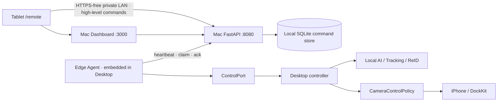
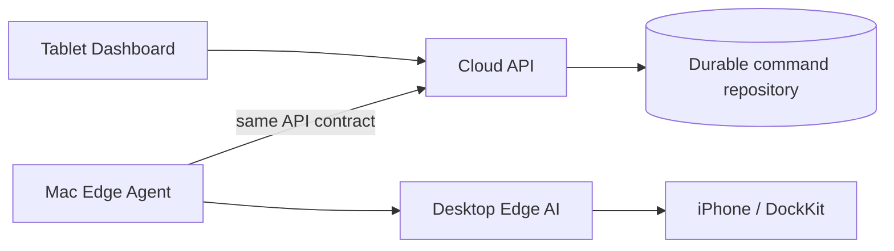
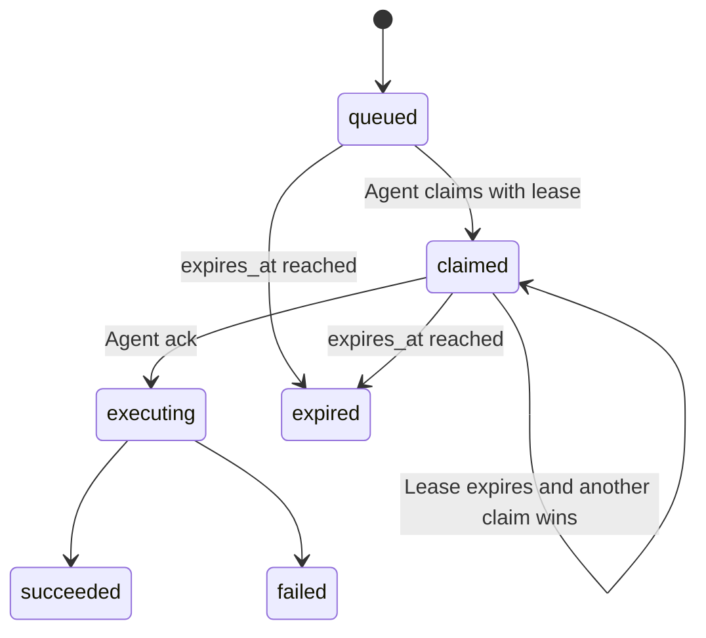

# Edge Control Plane MVP

## Scope

The tablet sends high-level intent only. Detection, YOLO inference, tracking,
ReID, framing, benchmarking, and DockKit safety remain on the Mac. No live video
is uploaded and the MVP creates no cloud resource.

## Local MVP



The Edge Agent is a daemon thread and does not prevent Desktop shutdown. A
control-plane outage only pauses heartbeat/claim retries; the Desktop tracking
session and local Emergency Stop continue independently.

## Future cloud topology



The API contract and Remote Console do not depend on SQLite. The
`EdgeControlRepository` port can be backed by PostgreSQL later.

## Command lifecycle



`command_id` is the idempotency key. Commands always carry an aware
`expires_at`. The SQLite claim uses an immediate transaction so two agents
cannot claim the same command concurrently. Emergency Stop uses priority 1000;
ordinary commands use 100.

## Authentication and validation

- The Edge Agent sends `X-Device-Token`, read only from
  `AIVD_EDGE_DEVICE_TOKEN`.
- The token is never written to the repository or Dashboard.
- Unknown command types, extra request fields, direct motor commands, invalid
  tracking modes, and invalid GIDs receive HTTP 422.
- The API accepts exact CORS origins from `AIVD_CORS_ALLOW_ORIGINS`; wildcard
  CORS is not enabled.
- Local Tablet command authorisation is intentionally a single-operator MVP.
  Firebase user authentication is a post-MVP item.

## Heartbeat and offline state

The agent reports every 1.5 seconds. The API derives `online=false` after six
seconds without a heartbeat. The state includes iPhone connection, DockKit
readiness, tracking state, current target, FPS, inference latency, last error,
and an explicit `simulated` flag.

## Emergency Stop safety

Emergency Stop has queue priority and requires two taps on the tablet within
five seconds. The Qt adapter invokes only `controller.emergency_stop()`. That
method stops tracking, publishes the existing STOP message, and resets
`CameraControlPolicy`. There is no yaw/pitch velocity field in the API or
`ControlPort`. Desktop Emergency Stop remains available when the API is down.

## LAN demo startup

Prerequisites:

```bash
.venv/bin/python -m pip install -e .
cd dashboard
npm install
cd ..
chmod +x tools/AI-Vision-Director-MVP.command
```

Put Mac, iPhone, and Tablet on the same private hotspot/router. Disable a VPN
that blocks local-network peers. Then double-click
`tools/AI-Vision-Director-MVP.command`, or run it from Terminal.

The script:

1. Discovers the Mac Wi-Fi IP.
2. Creates an ephemeral device token if one was not supplied.
3. Starts FastAPI on `0.0.0.0:8080`.
4. Starts the Dashboard on `0.0.0.0:3000`.
5. Opens Desktop with the in-process Edge Agent enabled.
6. Prints `http://<MAC_LAN_IP>:3000/remote`.

To find the address manually:

```bash
ipconfig getifaddr en0
```

If Wi-Fi uses another interface, inspect System Settings > Wi-Fi > Details >
TCP/IP, then set `AIVD_LAN_IP` before launching.

## Tomorrow's demonstration

1. Start the MVP command and leave its Terminal window open.
2. In Desktop, verify the iPhone and DockKit indicators. Unavailable hardware
   must remain visibly unavailable.
3. Open the printed `/remote` URL on the tablet.
4. Verify Edge Online and a recent heartbeat.
5. Tap Start Tracking and show queued/claimed/executing/succeeded.
6. Demonstrate Stop, Home, and the two-tap Emergency Stop.
7. Stop FastAPI only if demonstrating isolation: Desktop local tracking remains
   available, while the tablet becomes Offline.

## Known limitations and fallback

- Remote mode switching, GID selection, and Find Target are present in the
  contract/UI (P1), but the Qt adapter returns a clear failed status until their
  controller-thread argument bridge is enabled.
- The MVP UI uses one-second polling for the demonstration.
- `/ws/control-state` already exposes the compatible read-only state envelope;
  the MVP UI deliberately keeps one-second polling for tomorrow's lower-risk
  demonstration.
- No live video preview is included.
- The standalone Edge Agent CLI is useful for explicitly labeled `--demo`
  telemetry. Real Desktop control uses the agent embedded by the MVP launcher.
- If the local control plane fails, use the Desktop controls. Never interpret
  simulated telemetry as real hardware state.
