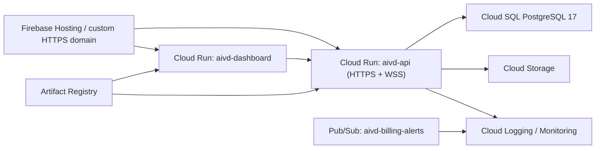

# Google Cloud Deployment — V3 Phase 5

Target project: `bright-torus-483009-k2`
Default region: `asia-east1` (Taiwan)

## Topology



`infra/gcp/` is the declarative source for Cloud Run, Cloud SQL, Cloud Storage,
Artifact Registry, Secret Manager, Pub/Sub, the US$1 notification budget, IAM,
and a Cloud Run 5xx alert. `firebase.json` provides the HTTPS frontend and
same-origin API rewrites.

## Cost safety

There are two different controls:

1. The Google Cloud native **spend cap budget** is scoped to Cloud Run and is
   the stop mechanism. Configure it as a monthly US$1 specified amount for
   project `bright-torus-483009-k2` and service `run.googleapis.com`.
2. Terraform creates a separate US$1 alert budget connected to
   `aivd-billing-alerts`. Pub/Sub is for notification and audit, not the stop
   mechanism.

The spend cap is based on estimated gross cost and is not instantaneous. A small
overrun remains possible. It also does not stop persistent Cloud SQL, Cloud
Storage, or Artifact Registry charges. Do not automatically unlink the entire
project from Cloud Billing: Google warns that doing so stops every service and
can make resources unrecoverable.

## Deployment

Run from an authenticated Cloud Shell after the billing account is active:

```bash
gcloud config set project bright-torus-483009-k2
gcloud services enable \
  artifactregistry.googleapis.com \
  billingbudgets.googleapis.com \
  cloudbilling.googleapis.com \
  cloudbuild.googleapis.com \
  firebase.googleapis.com \
  firebasehosting.googleapis.com \
  logging.googleapis.com \
  monitoring.googleapis.com \
  pubsub.googleapis.com \
  run.googleapis.com \
  secretmanager.googleapis.com \
  sqladmin.googleapis.com

terraform -chdir=infra/gcp init
terraform -chdir=infra/gcp apply \
  -target=google_artifact_registry_repository.containers

gcloud builds submit --config cloudbuild.yaml
```

Resolve each pushed image to a digest, copy
`infra/gcp/terraform.tfvars.example` to an untracked `terraform.tfvars`, insert
the immutable image references, then apply:

```bash
terraform -chdir=infra/gcp plan
terraform -chdir=infra/gcp apply
gcloud run jobs execute aivd-migrations \
  --region=asia-east1 \
  --wait
firebase deploy --only hosting --project bright-torus-483009-k2
```

Terraform state contains generated database credentials and must be stored in an
encrypted, access-controlled remote backend before team use.

## HTTPS, WSS, and domains

Firebase supplies managed HTTPS for the default `web.app` and `firebaseapp.com`
domains. Add a custom domain in Firebase Hosting and publish the exact DNS
records Firebase returns; the domain cannot be completed until its name and DNS
provider are known.

Cloud Run supports WebSockets. The API exposes `/ws/telemetry`, rejects origins
outside the Phase 3 allowlist, and the dashboard reconnects with bounded
exponential backoff. Cloud Run WebSockets are still subject to the configured
60-minute request timeout. Firebase Hosting rewrites have a 60-second request
timeout, so clients must reconnect; a dedicated Cloud Run WSS custom domain is
preferred for longer sessions.

## Operational defaults

- Cloud Run scales from zero and is capped at one instance while the budget is
  intentionally small.
- Cloud SQL has deletion protection, backups, point-in-time recovery, encrypted
  connections, and no authorized network list.
- Secrets are read through Secret Manager and default service-account
  credentials; no Firebase JSON key is placed in an image.
- Storage blocks public access, uses uniform access, versions objects, and moves
  objects older than 30 days to Nearline.
- Cloud Run automatically emits structured request/container logs. Monitoring
  alerts on any sustained API 5xx response rate.
